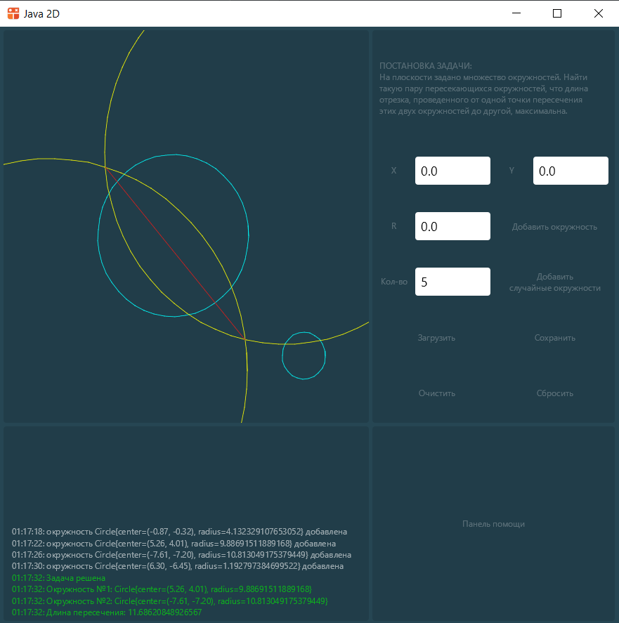

# Проект по информатике

----

### Зубарев Александр 10-2

Задача №5:
На плоскости задано множество окружностей. Найти такую пару пересекающихся окружностей, что длина отрезка, проведенного от одной точки пересечения этих двух окружностей до другой, максимальна. В качестве ответа: выделить эту пару окружностей, нарисовать отрезок между найденными точками пересечения.

